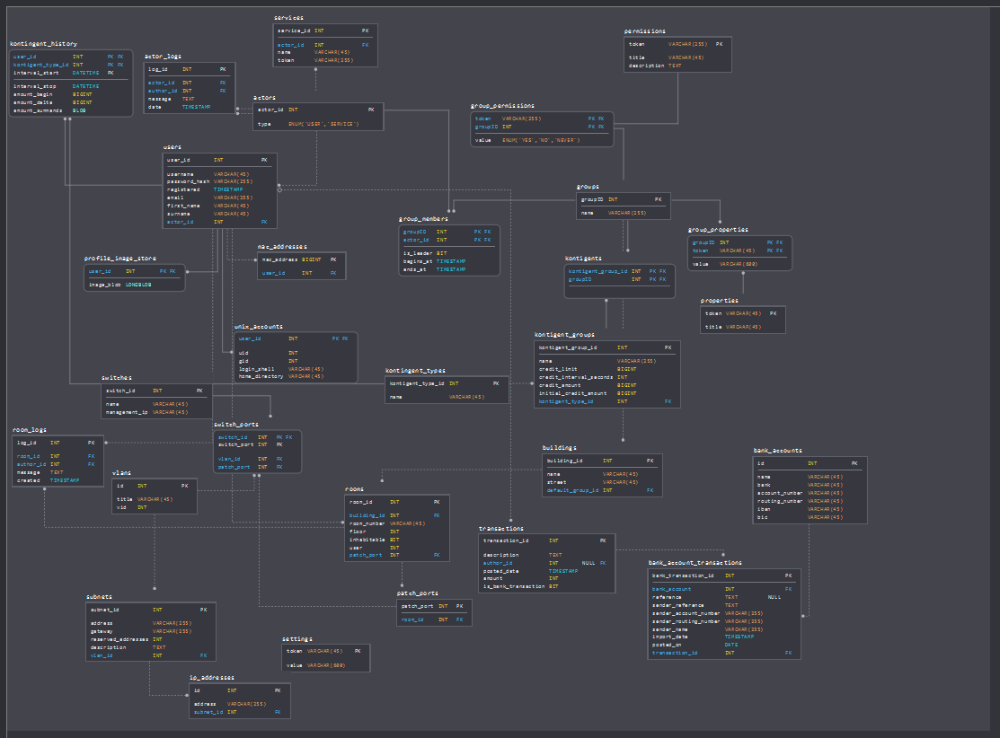

# JCroft

The new AG DSN management system

[](https://travis-ci.org/JGDSN/jcroft)
[](https://waffle.io/JGDSN/jcroft)
[](https://sonarcloud.io/dashboard/index/de.agdsn%3Ajcroft) 
[](https://sonarcloud.io/dashboard/index/de.agdsn%3Ajcroft) 
[](https://sonarcloud.io/dashboard/index/de.agdsn%3Ajcroft) 
[](https://sonarcloud.io/dashboard/index/de.agdsn%3Ajcroft) 
[](https://sonarcloud.io/dashboard/index/de.agdsn%3Ajcroft) 
[](https://sonarcloud.io/dashboard/index/de.agdsn%3Ajcroft) 
[](https://sonarcloud.io/dashboard/index/de.agdsn%3Ajcroft) 
[](https://sonarcloud.io/dashboard/index/de.agdsn%3Ajcroft) 

[](https://sonarcloud.io/dashboard/index/de.agdsn%3Ajcroft)

## Requirements

  - Java 8+ (plan: **Java 10**)
  - Maven
  - PostGreSQL
  - [Hazelcast.org](http://hazelcast.org) for scaling and high availability
  - LDAP server for authentification

## How To

```bash
mvn clean install
```

German introduction to maven:

  - http://jukusoft.com/2016/10/24/tutorial-eine-einfuehrung-in-maven-teil-1/
  - http://jukusoft.com/2016/10/29/tutorial-einfuehrung-maven-teil-2/
  
**Additionally you need a LDAP server.**\
For AGDSN you have to be in internal management network or add a port forwarding for **127.0.0.1:389 --> IDM Server:389**

You can add port a forwarding with [Bitvise]() for example:


Change your jcroft config (will be created on first run) to use your tunnel to the LDAP authentication database.

**settings/jcroft.cfg**:
```text
ldap_host=localhost
ldap_port=389

; database connection
jdbc_ip=localhost
jdbc_port=5432
jdbc_user=jcroft
jdbc_password=ENTER YOUR PASSWORD HERE
jdbc_database=jcroft

; hibernate configuration (only change this, if you know, what you do)
hibernate.hbm2ddl.auto=update
hibernate.dialect=org.hibernate.dialect.PostgreSQL95Dialect

; hazelcast cluster configuration
hz_group_name=dev
hz_group_password=dev-pass
hz_instance_name=cache-1
hz_members=127.0.0.1,127.0.0.2
```

## Database

Currently we use an PostGreSQL database with JPA / Hibernate and Hazelcast.

  - [Database Schema](https://app.sqldbm.com/MySQL/Share/C2bOULcGZVny5FcHjmqf5EGFrngIE8md_DYjF4jNYw0)

(Maybe outdated) database schema (WIP):


## Technical Requirements

## Non-Technical Requirements

  - scaling out with load balancers
  - high availibility clusters
  - failover node
  - **Privacy by design** (DSGVO-conform)
  
## Presentation

  - [Slides](https://slides.com/juku/deck)
  - [Database Schema](https://app.sqldbm.com/MySQL/Share/C2bOULcGZVny5FcHjmqf5EGFrngIE8md_DYjF4jNYw0)
  
## FAQ

### Why there is a InvocationTargetException on start?

Maybe, you get this exception on startup:
```java
java.lang.reflect.InvocationTargetException: null
	at sun.reflect.NativeMethodAccessorImpl.invoke0(Native Method) ~[na:1.8.0_91]
	at sun.reflect.NativeMethodAccessorImpl.invoke(NativeMethodAccessorImpl.java:62) ~[na:1.8.0_91]
	at sun.reflect.DelegatingMethodAccessorImpl.invoke(DelegatingMethodAccessorImpl.java:43) ~[na:1.8.0_91]
	at java.lang.reflect.Method.invoke(Method.java:498) ~[na:1.8.0_91]
	
	...
	
	at de.agdsn.jcroft.Application.main(Application.java:42) ~[classes/:na]
Caused by: java.sql.SQLFeatureNotSupportedException: Die Methode org.postgresql.jdbc4.Jdbc4Connection.createClob() ist noch nicht implementiert.
	at org.postgresql.Driver.notImplemented(Driver.java:753) ~[postgresql-9.1-901-1.jdbc4.jar:na]
	at org.postgresql.jdbc4.AbstractJdbc4Connection.createClob(AbstractJdbc4Connection.java:52) ~[postgresql-9.1-901-1.jdbc4.jar:na]
	at org.postgresql.jdbc4.Jdbc4Connection.createClob(Jdbc4Connection.java:21) ~[postgresql-9.1-901-1.jdbc4.jar:na]
	... 44 common frames omitted
```

You can ignore this exception, because hibernate only throws this exception because PostGreSQL doesnt support an specific feature.\
"Die Methode org.postgresql.jdbc4.Jdbc4Connection.createClob() ist noch nicht implementiert".
