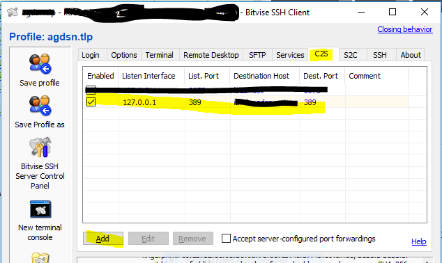

# jcroft

The new AG DSN management system

[](https://travis-ci.org/JGDSN/jcroft)
[](https://waffle.io/JGDSN/jcroft)
[](https://sonarcloud.io/dashboard/index/de.agdsn%3Ajcroft) 
[](https://sonarcloud.io/dashboard/index/de.agdsn%3Ajcroft) 
[](https://sonarcloud.io/dashboard/index/de.agdsn%3Ajcroft) 
[](https://sonarcloud.io/dashboard/index/de.agdsn%3Ajcroft) 
[](https://sonarcloud.io/dashboard/index/de.agdsn%3Ajcroft) 
[](https://sonarcloud.io/dashboard/index/de.agdsn%3Ajcroft) 
[](https://sonarcloud.io/dashboard/index/de.agdsn%3Ajcroft) 
[](https://sonarcloud.io/dashboard/index/de.agdsn%3Ajcroft) 
[](https://codecov.io/gh/JGDSN/jcroft)

[](https://sonarcloud.io/dashboard/index/de.agdsn%3Ajcroft)

## Requirements

  - Java 8+ (plan: **Java 10**)
  - Maven
  - PostGreSQL
  - evtl. [Hazelcast.org](http://hazelcast.org) for scaling out
  - LDAP server for authentification

## How To

```bash
mvn clean install
```

German introduction to maven:

  - http://jukusoft.com/2016/10/24/tutorial-eine-einfuehrung-in-maven-teil-1/
  - http://jukusoft.com/2016/10/29/tutorial-einfuehrung-maven-teil-2/
  
**Additionally you need a LDAP server.**\
For AGDSN you have to be in internal management netz or add a port forwarding for **127.0.0.1:389 --> IDM Server:389**

You can add port forwarding with [Bitvise]() for example:


**settings/jcroft.cfg**:
```text
ldap_host=localhost
ldap_port=389
```

## Technical Requirements

## Non-Technical Requirements

  - failover node
  - **Privacy by design** (DSGVO-conform)